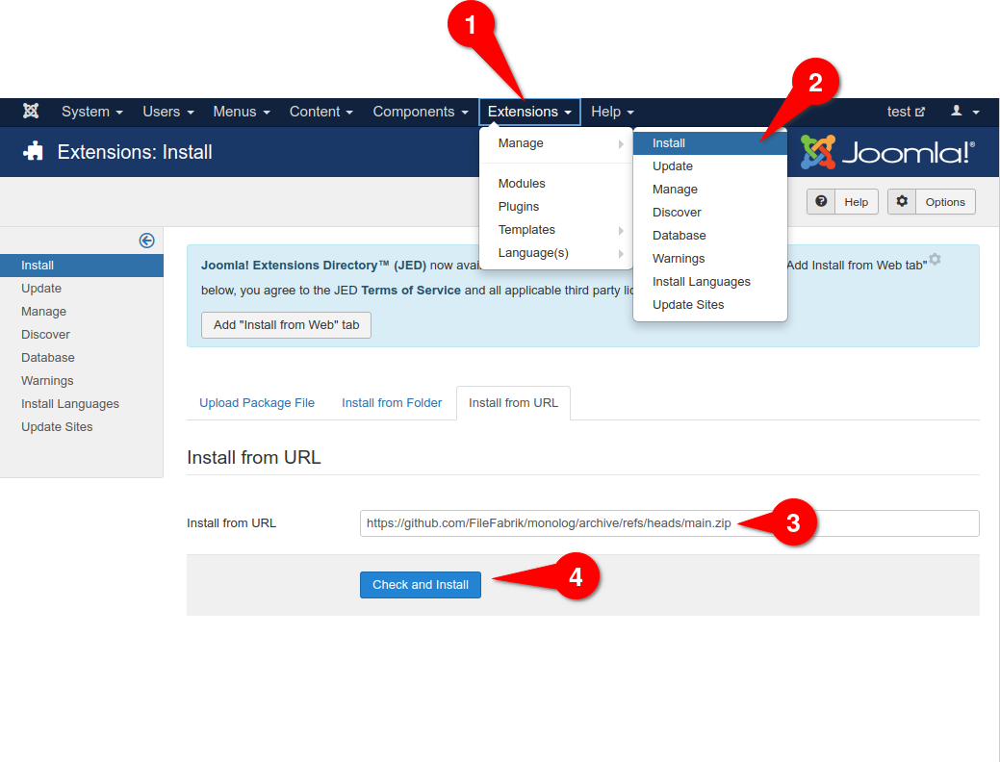

# monolog for joomla

Monolog Library for Joomla 3.* with installer

## Installation in joomla 

Copy this url and follow the installation steps as shown in the description.

```shell
https://github.com/FileFabrik/monolog/archive/refs/heads/main.zip
```



## Monolog without Modifications 

src completely from tag 2.2.0
https://github.com/Seldaek/monolog/tree/2.2.0

## Usage in your   Joomla-Component| Plugin | Library | Module

Simple example to load the library into your Joomla-Component| Plugin | Library

```php 
class MyClass{


	/**
	 * @return string|null
	 */
	public static function isMonologLibrary()
	{
	    // the index.php is a simple connector to composer psr4 autoload 
		$monologCustomDir = JPATH_LIBRARIES . '/monolog/index.php';

		return (is_file($monologCustomDir)) ? $monologCustomDir : null;
	}

	/**
	 * @return bool
	 */
	public static function loadMonolog(): bool
	{
		$monologDir = self::isMonologLibrary();
		if ($monologDir)
		{
			require_once $monologDir;

			return true;
		}

		return false;
	}

}
```

## Nginx-Users

...should disable the webserver-access from outside to the monolog library. 
Have a look at the installed .htaccess file in this directory
